# F&middot;R&middot;I&middot;E&middot;N&middot;D&middot;S Quiz
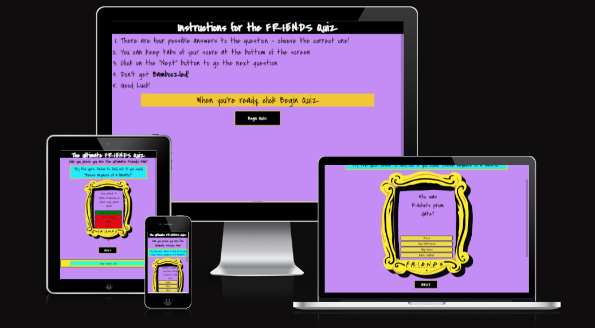
### Welcome to the Ultimate F&middot;R&middot;I&middot;E&middot;N&middot;D&middot;S Quiz

Are you a Friends fan, maybe the biggest Stan out there? Well why not prove it with the Ultimate Friends Quiz?
The Ultimate Friends Quiz has questions from all of the series that will challenge even the most die hard fan! Will you be the Best of Friends or will you just be a mere acquaintance?

I created the Friends Quiz, because as a huge fan myself, I love testing my knowledge on the subject. Users will find the quiz to be somewhat of a challenge
as they navigate through the simple, intuitive and fun layout.

## CONTENT LINKS

### [User Experience(UX/UI)](#user-experience)

- [User stories](#user-stories)
- [Color Scheme](#color-scheme)
- [Typography](#typography)
- [Wireframes](#wire-frames)

### [Features](#features)

- [Overview](#overview)
- [Rules Page](#rules-page)
- [Question and Answer Box](#question-and-answer-box)
- [Cursor Emoji](#cursor-emoji)
- [Error Message](#error-message)
- [Next button](#next-button)
- [Keeping Score](#keeping-score)
- [Theme Tune](#theme-tune)
- [Future Features](#future-features)

### [Technologies Used](#technologies-used-1)

- [Languages Used](#languages)
- [Frameworks, Libraries and Programs](#frameworks-libraries-and-programs)

### [Testing](#testing-1)

- [Code validation](#code-validation)
- [Accessability](#accessability)
- [Testing Table](#testing-table)

## User Experience

The quiz is of a simple but fully responsive design, using JavaScript to create a dynamic and interactive experience for the user. The question box has a multichoice answer section, that will only allow one attempt at the correct answer. If the correct answer is selected, it will change to purple, if incorrect, it will change to red. The user
will then click on the "Next" button to take them to the next question, and the computer will tally up their scores.

At the end of the quiz, the Next button will change to Play Again and the quiz will reset.

### User Stories

1. As a user, I want to be able to find the site easily by inputting obvious keywords into the browser's searchbar.
2. As a user, I want to be able to learn how to play the game before I begin.
3. As a user, I want the questions to be somewhat challenging.
4. As a user, I want to navigate the page easily and intuitively.

### As a Developer:

1. I want users to feel engaged in the game.
2. I want the color-theme to envoke a feeling of familiarity and nostalgia.
3. I want users to recognise quickly how simialr the font used is to the original.
4. I want users to be able to intuitively know which buttons to click.
5. I want users to find instructions on game play easy to understand.

### Color Scheme

I decided to use the main color scheme in Monica's appartment which are widely recognised and cherished. Being purple and Gold,they also
go together very aesthicially. I also embedded an image of the notorious yellow frame which sits on Monica's door, another instantly recognisable feature on the sitcom.
The colors are used for the rules page and the main page for fluidity.

### Typography

I used Google fonts, Covered By Your Grace", which I found to be the closest to the Friends original typography with sans-serif to fall back on, should the users system fail to load the Google font.

 To make the Friends logo more authentic, I used middots and coloured them to the friends logo. I also used this theme in the Next Button and on the windows tab title.

### Wire frames

As per The five planes, I used Balsamiq Wireframes to conceptualize my vision for the quiz. I made the main quiz on mobile and desktops to see how it would look.

Mobile View:
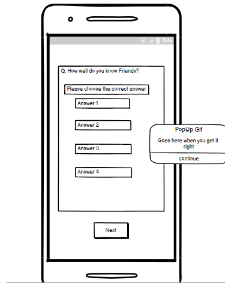

Windows View:
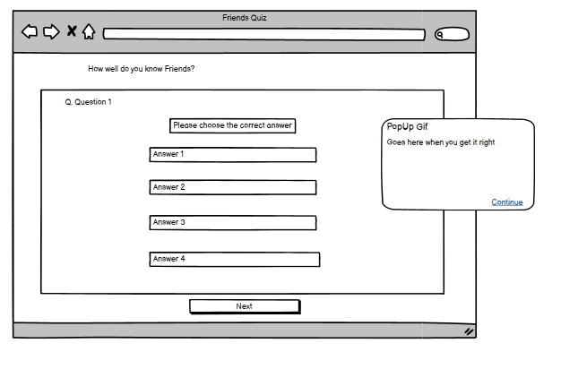

## Features

### Overview
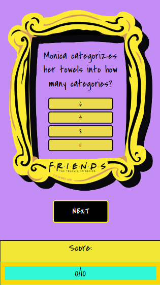

I began developing my site using a mobile first approach, based on the Galaxy Fold Screen size(340px) and added media Queries for responsiveness on larger screens.

### Rules Page
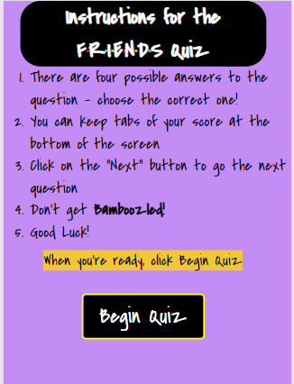

The Rules page has a list of instructions on how to play the game. It is styled in the same manner as the main page.

### Question and Answer Box
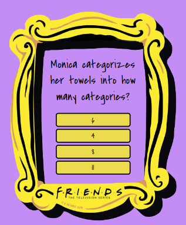

The question and answer box is located in the Friends Photo Frame image. The answer boxes will change to purple when hovered over. You get one chance to answer.
The questions will be shuffled each time you start the game, to give a better repeat experience.

### Cursor Emoji
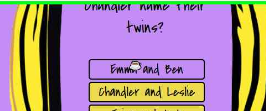

For the cursor on larger screens, I changed to have a coffee cup emoji for some added fun and interest.  I used the Steps Recorder App to screenshot the cursor.

### Error Message
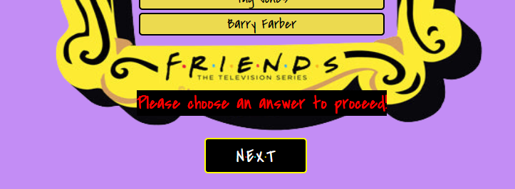

Should the user click the Next button instead of answering, an error popup message will appear to explain they need to choose an answer before proceeding.

### Next Button

Using Middots again, I made the Next Button look like the Friends logo.
### Keeping Score
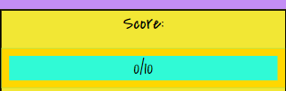

The score card is located under the Next button and is big enough that the user can easily glance during game play to see the score which is tallied up
as the game continues. 

In larger screen sizes, it moves to the left of the game to reduce redundant space and so the user can see it as they play.

### Theme Tune

I added in the Friends theme tune song with added controls for an even more immersive experience, should the user want to listen to it. 
It will not play automatically as this can have a negative effect on the user's experience.

### Future Features
For the future of the site, I would like to add more questions to the main quiz and maybe categorise them into the different series'.

I would also like to add a Top-Scorer feature, so users can battle eachother from around the world.

I would also like to add a category quiz on the characters and actors who play them.

## Technologies used

### Languages

<li>HTML 5</li>
<li>CSS</li>
<li>Javascript</li>

### Frameworks, Libraries and Programs

#### Google Fonts
I imported Google fonts and placed it in the style tag in the HTML file.
#### Favicon
For my Favicon, I used The Noun Project, and changed the colour to purple for theme fluidity.
#### Gitpod
I used Gitpod to write the code, commit messages and push to Github.
#### Github
I used Github to store my project and to deploy it.
#### Am I Responsive
I used the Am I responsive website to give a screenshot of how my site looks on various screen sizes. [See here](#friends-quiz)
#### Balsamiq
I used Balsamiq to create the wireframe for my project.

## Testing

### Code Validation

I used W3C Jigsaw to validate the CSS, which came back with no errors
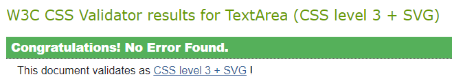

I did get some warnings relating to the border on my H1 main heading, I corrected this and when re-validating it came back clear with no more warnings. I didn't realise you didn't have to have a border in order to use border-radius styling.
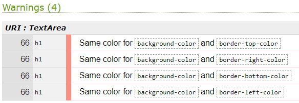

I used W3C Markup to validate the HTML file, which returned no errors.
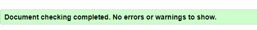 

I used JSHint to validate the javascript code, which resulted in no errors
### Accessibility

To check the sites accessibility, I used Lighthouse in Dev Tools

Rules Page:
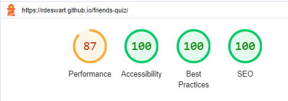

Main Page:
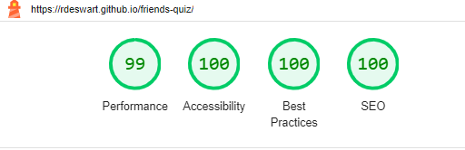

### Browser Testing
To make the site responsive on all devices, I used Media queries. I started the development of the code on large screen devices which I quickly realised was wrong and changed to developing it with a "mobile first" approach, specifically The Galaxy Fold, whose screen size is 344 x 882px.

I had some issues with the length of the questions rendering properly as I used an image for the question container. To remedy this, I played back and forth with padding in dev tools and in two instances, I just had to re-write the question to make it shorter.

#### Unsolved Bugs:
There is an issue with horizontal scrolling on some screens, I think it is an issue with either the image or the .question-container, but I didn't have enough time to fix it, and it doesn't take away from any functionality.

### Testing Table

| Feature:               | Expected outcome:                                                 | Pass/Fail: |
| :--------------------- | :---------------------------------------------------------------- | :--------- |
| Url address            | Landing/Rules Page                                                | Pass       |
| Rules Page             | Rules font is clear and legible                                   | Pass       |
| Begin Quiz Button      | Moves onto main landing page                                      | Pass       |
| Quiz Page              | 1st question renders                                              | Pass       |
| Quiz Page              | 4 possible answers to 1st q renders                               | Pass       |
| Shuffle Questions      | Each new round should have questions asked in a different order | Pass       |
| Answer Buttons Hovered | Change to color purple when hovered over                          | Pass       |
| Answer Button clicked  | Only allowed to click one answer                                  | Pass       |
| Emoji cursor on large screens | Appear when hover over answer & Next Button| Pass|
| Wrong Answer           | Button turns red when wrong ans selected                          | Pass       |
| Correct Answer         | Button turns green to show correct answer                         | Pass       |
| Next Button clicked    | Question and answer options change                                | Pass       |
| Score Board            | Correct answers are tallied up and shown on score board           | Pass       |
| Media Player mute      | Media player is muted until user interaction with controls        | Pass       |
| Media Player play      | Theme tune plays at user set volume                               | Pass       |
| End Game popup         | Quiz Completed message                                            | Pass       |
| Next Game              | when questions reach 10, restart game                             | Pass       |
| Play Again             | Next Button changes to Play Again when game complete              | Pass       |
## Deployment
I used Gitpod to develop the code and then pushed to Github.

Here are the following steps I used to deploy the website from Github repository to Github Pages.

1. Log in to Github and find the repository you wish to deploy.
2. At the top of the page, click on "Settings".
3. On the left hand side of the settings page, under Code and automation, click on "Pages".
4. From the source section drop-down menu, select the Master Branch.
5. Once the master branch has been selected, the page will be automatically refreshed with a detailed ribbon display to indicate the successful deployment.

The live link can be found here:
[Friends Quiz](https://rdeswart.github.io/friends-quiz/)
## Credits
### Content
The wireframe was created using [Balsamiq](https://balsamiq.com/)

The Questions for the game were taken from [Parade](https://parade.com/1061827/alexandra-hurtado/friends-trivia-questions/)

Array Random(Fisher-Yates) method code from [Stack Overflow](https://stackoverflow.com/questions/2450954/how-to-randomize-shuffle-a-javascript-array). I used this instead of the splice method, which I did originally but it was only giving me 5 questions randomly then stopping.

I want to give a huge thank you to my fellow student [Vernell Clarke](https://github.com/VCGithubCode), without whom I would not have been able to finish my project. He took many hours out of his time, to go through and tutor me on my code. His patience and knowledge have been invaluable to me during what I found to be quite a stressful and often times frustrating project. His positive "can-do" attitude is what got me over the line. And all the little tips and shortcuts were so helpful to learn!

Chat Gtp to explain reasoning and help with bracket closure placements.

Inspiration for the start of the code from YouTube video [Great Stack](https://www.youtube.com/watch?v=PBcqGxrr9g8&t=1393s)

Event listeners tutorials from [MDN Web Docs](https://developer.mozilla.org/en-US/docs/Web/API/EventTarget/addEventListener)

Font from [Google Fonts](https://fonts.google.com/)

Favicon from [The Noun Project](https://thenounproject.com/)

### Media
Theme tune for Friends at [Archive.org](https://archive.org/details/tvtunes_31736)

The image frame for the main page was taken from [Comedy Shop](https://comedyshop.com/products/new-world-sales-friends-frame-magnet-mcm-005) and background removed in [Canva](https://www.canva.com/)

I changed the cursor to a cup of coffee emoji for larger screen players. The code for this was acquired at [Emoji Cursor App](https://www.emojicursor.app/)

I got the coffee cup emoji from [Emoji DB](https://emojidb.org/friends-tv-show-emojis)

[Back to Top](#welcome-to-the-ultimate-friends-quiz)